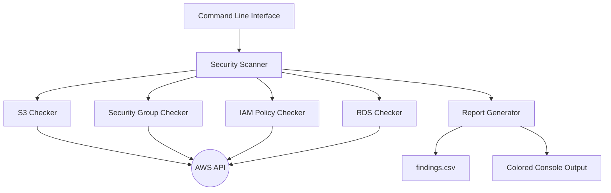
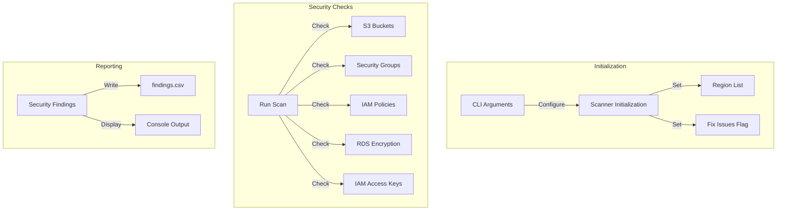
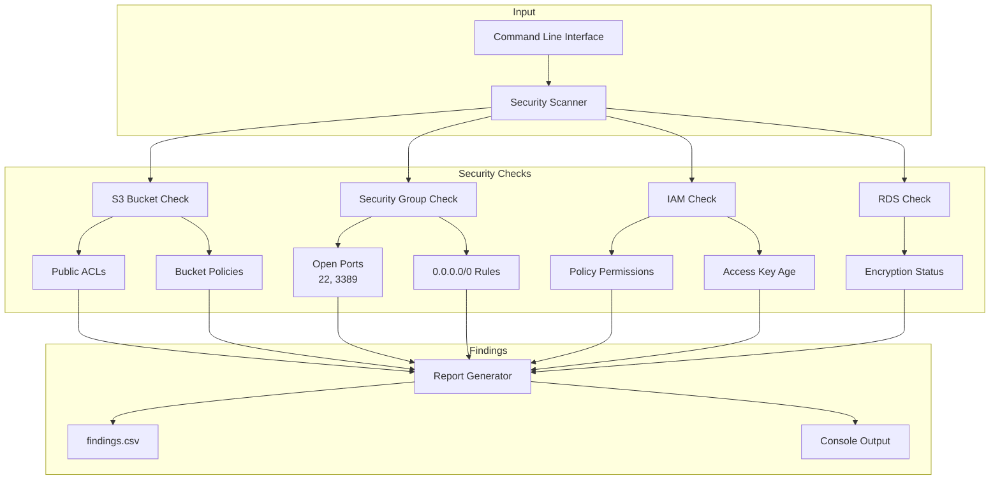

# AWS Security Scanner

A Python-based security auditing tool for AWS infrastructure that automatically detects and reports security misconfigurations. This tool helps security teams and DevOps engineers maintain a secure AWS environment through automated scanning and reporting.

## 🔍 Core Features

### S3 Bucket Security
```python
def check_s3_buckets(self):
    # Scans S3 buckets for:
    # - Public access through ACLs
    # - Public bucket policies
    # - Misconfigured permissions
```
- Detects publicly accessible buckets
- Identifies risky bucket policies
- Supports automatic remediation
- Handles exceptions gracefully

### Security Group Analysis
```python
def check_security_groups(self, region):
    # Analyzes security groups for:
    # - Open SSH (22) and RDP (3389) ports
    # - 0.0.0.0/0 CIDR rules
    # - Overly permissive inbound rules
```
- Finds dangerous inbound rules
- Multi-region security group scanning
- Reports critical security gaps
- Identifies exposed ports

### IAM Security Checks
```python
def check_iam_policies(self):
    # Reviews IAM configurations:
    # - Overly permissive policies
    # - Dangerous wildcards (Action: "*")
    # - Access key rotation
```
- Analyzes policy permissions
- Checks access key age
- Identifies risky configurations
- Supports large-scale IAM audits

### RDS Security Verification
```python
def check_rds_encryption(self, region):
    # Verifies RDS security:
    # - Encryption status
    # - Multi-region scanning
    # - Security warnings
```
- Checks database encryption
- Multi-region support
- Clear security reporting
- Exception handling

## 📊 Architecture

### Component Diagram


**Component Explanation:**
1. **CLI**: Command-line interface for running scans
2. **Scanner**: Core engine that coordinates security checks
3. **Checkers**: Individual modules for each AWS service
4. **AWS API**: Interface with AWS services via boto3
5. **Report Generator**: Creates findings reports

### Security Check Flow


## 🚀 Quick Start

### Installation
```bash
# Clone repository
git clone https://github.com/yourusername/aws-security-scanner.git
cd aws-security-scanner

# Create virtual environment
python -m venv venv
source venv/bin/activate  # Windows: venv\Scripts\activate

# Install dependencies
pip install -r requirements.txt
```

### Basic Usage
```bash
# Basic scan in default region
python src/aws_security_scanner.py

# Multi-region scan
python src/aws_security_scanner.py --regions us-east-1 us-west-2

# Scan with auto-fix enabled
python src/aws_security_scanner.py --fix
```

## 📝 Report Format

The scanner generates two types of output:

1. **Console Output**
```
[CRITICAL] S3: Bucket has public access (my-bucket)
[WARNING] IAM: Access key is 95 days old (user/AKIA...)
[CRITICAL] EC2: Security group allows SSH from anywhere (sg-123...)
```

2. **CSV Report** (findings.csv)
```csv
service,resource_id,issue,severity,timestamp
S3,my-bucket,Public access enabled,CRITICAL,2024-04-04T16:00:00
IAM,user/key-id,Access key age > 90 days,WARNING,2024-04-04T16:00:00
```

## 🔑 Required AWS Permissions

```json
{
    "Version": "2012-10-17",
    "Statement": [
        {
            "Effect": "Allow",
            "Action": [
                "s3:ListAllMyBuckets",
                "s3:GetBucketAcl",
                "s3:GetBucketPolicy",
                "s3:PutBucketPublicAccessBlock",
                "ec2:DescribeSecurityGroups",
                "rds:DescribeDBInstances",
                "iam:ListPolicies",
                "iam:GetPolicyVersion",
                "iam:ListUsers",
                "iam:ListAccessKeys"
            ],
            "Resource": "*"
        }
    ]
}
```

## 🛠️ Dependencies

- **boto3**: AWS SDK for Python
- **colorama**: Cross-platform colored terminal output
- **python-dateutil**: Date handling utilities

## 🐛 Error Handling

The scanner includes robust error handling:
```python
try:
    # AWS API calls with proper error handling
    s3_client.get_bucket_policy(Bucket=bucket_name)
except s3_client.exceptions.NoSuchBucketPolicy:
    # Handle missing bucket policy
    pass
except Exception as e:
    # Handle other AWS API errors
    print(f"Error: {str(e)}")
```

- Graceful handling of API errors
- Clear error messages
- Continued operation after non-critical errors
- Proper exception logging

## 🤝 Contributing

1. Fork the repository
2. Create a feature branch
3. Write tests for your changes
4. Submit a pull request

## 📄 License

This project is licensed under the MIT License - see the LICENSE file for details.

## 🔍 Example Findings

```python
# Example security findings:
findings = [
    {
        'service': 'S3',
        'resource_id': 'my-bucket',
        'issue': 'Public access enabled',
        'severity': 'CRITICAL',
        'timestamp': '2024-04-04T16:00:00'
    },
    {
        'service': 'EC2',
        'resource_id': 'sg-123abc',
        'issue': 'Open SSH access (0.0.0.0/0)',
        'severity': 'CRITICAL',
        'timestamp': '2024-04-04T16:00:01'
    }
] 
```

## Architecture Overview



## Key Components

1. **Input Processing**
   ```python
   def __init__(self, regions: List[str], fix_issues: bool = False):
       self.regions = regions
       self.fix_issues = fix_issues
   ```

2. **Security Checks**
   - **S3 Bucket Security**
     ```python
     def check_s3_buckets(self):
         # Checks public access and bucket policies
     ```
   - **Security Groups**
     ```python
     def check_security_groups(self, region: str):
         # Checks for dangerous inbound rules
     ```
   - **IAM Security**
     ```python
     def check_iam_policies(self):
         # Checks for overly permissive policies
     def check_iam_access_keys(self):
         # Checks for old access keys
     ```
   - **RDS Security**
     ```python
     def check_rds_encryption(self, region: str):
         # Checks database encryption status
     ```

3. **Report Generation**
   ```python
   def add_finding(self, service: str, resource_id: str, issue: str, severity: str):
       # Adds security findings to report
   def generate_report(self, output_file='findings.csv'):
       # Generates CSV report
   ```

## Usage

```bash
# Basic scan
python src/aws_security_scanner.py

# Multi-region scan
python src/aws_security_scanner.py --regions us-east-1 us-west-2

# With auto-fix enabled
python src/aws_security_scanner.py --fix