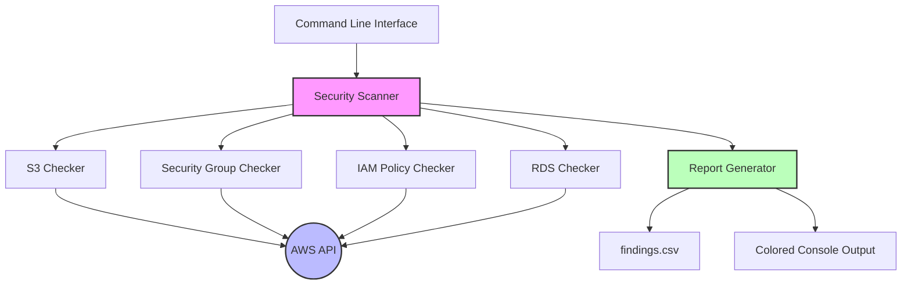
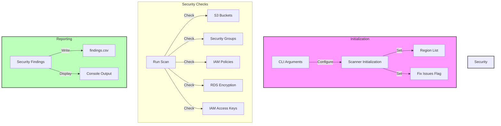

# AWS Security Scanner

A Python-based security auditing tool that automatically identifies security risks and misconfigurations in your AWS infrastructure. The tool performs comprehensive security checks across multiple AWS services and provides detailed reports with severity-based findings.

## Features

### S3 Bucket Security Checks
- ✅ Detects publicly accessible buckets through ACL permissions
- ✅ Identifies buckets with public bucket policies
- ✅ Optional automatic remediation of public access issues
- ✅ Handles bucket policy exceptions gracefully

### Security Group Analysis
- ✅ Identifies dangerous inbound rules (0.0.0.0/0)
- ✅ Detects open SSH (port 22) and RDP (port 3389) access
- ✅ Scans security groups across multiple regions
- ✅ Reports CRITICAL findings for dangerous configurations

### IAM Security Audit
- ✅ Analyzes IAM policies for overly permissive rules
- ✅ Detects use of dangerous wildcards (Action: "*")
- ✅ Identifies access keys older than 90 days
- ✅ Supports pagination for large IAM policy sets

### RDS Security Verification
- ✅ Checks encryption status of RDS instances
- ✅ Multi-region RDS instance scanning
- ✅ Reports unencrypted databases as security warnings
- ✅ Handles RDS API exceptions gracefully

### Reporting Capabilities
- ✅ CSV report generation with detailed findings
- ✅ Color-coded console output (RED: CRITICAL, YELLOW: WARNING)
- ✅ Timestamp tracking for all findings
- ✅ Structured output format for easy parsing

## Project Architecture

### Component Diagram


### Security Check Flow


## Installation

1. Clone the repository:
```bash
git clone https://github.com/yourusername/aws-security-scanner.git
cd aws-security-scanner
```

2. Create a virtual environment:
```bash
python -m venv venv
source venv/bin/activate  # On Windows: venv\Scripts\activate
```

3. Install dependencies:
```bash
pip install -r requirements.txt
```

## Usage

### Basic Scan
```bash
python src/aws_security_scanner.py
```

### Multi-Region Scan
```bash
python src/aws_security_scanner.py --regions us-east-1 us-west-2 eu-west-1
```

### Scan with Auto-Fix
```bash
python src/aws_security_scanner.py --fix
```

## Required AWS Permissions

```json
{
    "Version": "2012-10-17",
    "Statement": [
        {
            "Effect": "Allow",
            "Action": [
                "s3:ListAllMyBuckets",
                "s3:GetBucketAcl",
                "s3:GetBucketPolicy",
                "s3:PutBucketPublicAccessBlock",
                "ec2:DescribeSecurityGroups",
                "rds:DescribeDBInstances",
                "iam:ListPolicies",
                "iam:GetPolicyVersion",
                "iam:ListUsers",
                "iam:ListAccessKeys"
            ],
            "Resource": "*"
        }
    ]
}
```

## Output Format

The tool generates a CSV report (`findings.csv`) with the following columns:
- `service`: AWS service (S3, EC2, IAM, RDS)
- `resource_id`: Identifier of the resource
- `issue`: Description of the security issue
- `severity`: CRITICAL or WARNING
- `timestamp`: When the issue was detected

## Dependencies

- Python 3.10+
- boto3
- colorama
- python-dateutil

## Error Handling

The scanner includes comprehensive error handling:
- Graceful handling of missing bucket policies
- Region-specific service availability
- API rate limiting and throttling
- Access permission issues

## Contributing

1. Fork the repository
2. Create a feature branch
3. Implement your changes with tests
4. Submit a pull request

## License

This project is licensed under the MIT License - see the LICENSE file for details. 