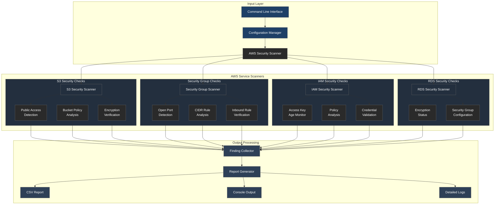

# AWS Security Scanner

A comprehensive Python-based security auditing tool for AWS infrastructure that automatically detects and reports potential security misconfigurations. This tool helps DevSecOps teams maintain a secure AWS environment through automated scanning and detailed reporting.

## 🔍 Core Features

The AWS Security Scanner performs automated security checks across multiple AWS services:

### S3 Bucket Security
- Detects publicly accessible buckets
- Identifies bucket policy misconfigurations
- Validates bucket encryption settings
- Reports security findings with severity levels

### Security Group Analysis
- Scans for open ports and risky rules
- Identifies overly permissive inbound rules
- Supports multi-region security group scanning
- Reports critical security gaps

### IAM Security Verification
- Monitors access key age and rotation
- Identifies inactive or expired credentials
- Supports automated key rotation
- Provides detailed IAM security reports

### RDS Security Checks
- Verifies database encryption status
- Validates security group configurations
- Supports multi-region scanning
- Reports encryption compliance status

## 📊 Architecture

```mermaid
flowchart TB
    CLI[Command Line Interface] --> Scanner[AWS Security Scanner]
    
    Scanner --> S3[S3 Security]
    Scanner --> SG[Security Groups]
    Scanner --> IAM[IAM Security]
    Scanner --> RDS[RDS Security]
    
    S3 --> Report[Report Generator]
    SG --> Report
    IAM --> Report
    RDS --> Report
    
    Report --> Output[Security Findings]

    style CLI fill:#1a1a1a,stroke:#333,stroke-width:2px
    style Scanner fill:#1a1a1a,stroke:#333,stroke-width:2px
    style S3 fill:#1a1a1a,stroke:#333,stroke-width:2px
    style SG fill:#1a1a1a,stroke:#333,stroke-width:2px
    style IAM fill:#1a1a1a,stroke:#333,stroke-width:2px
    style RDS fill:#1a1a1a,stroke:#333,stroke-width:2px
    style Report fill:#1a1a1a,stroke:#333,stroke-width:2px
    style Output fill:#1a1a1a,stroke:#333,stroke-width:2px
```



## 🚀 Quick Start

### Prerequisites
- Python 3.8 or higher
- AWS credentials configured (`~/.aws/credentials` or environment variables)
- Required AWS permissions (see below)

### Installation
```bash
# Clone repository
git clone https://github.com/yourusername/aws-security-scanner.git
cd aws-security-scanner

# Create virtual environment
python -m venv venv
source venv/bin/activate  # Windows: venv\Scripts\activate

# Install dependencies
pip install -r requirements.txt
```

### Usage
```bash
# Basic scan in default region
python src/aws_security_scanner.py

# Scan specific regions
python src/aws_security_scanner.py --regions us-east-1 us-west-2

# View detailed help
python src/aws_security_scanner.py --help
```

## 🔑 Required AWS Permissions

The scanner requires the following AWS permissions:

```json
{
    "Version": "2012-10-17",
    "Statement": [
        {
            "Effect": "Allow",
            "Action": [
                "s3:ListAllMyBuckets",
                "s3:GetBucketAcl",
                "s3:GetBucketPolicy",
                "ec2:DescribeSecurityGroups",
                "ec2:DescribeRegions",
                "rds:DescribeDBInstances",
                "iam:ListUsers",
                "iam:ListAccessKeys",
                "iam:GetAccessKeyLastUsed"
            ],
            "Resource": "*"
        }
    ]
}
```

## 📝 Output Format

### Console Output
The scanner provides real-time feedback with color-coded severity levels:
```
[CRITICAL] S3: Public access detected in bucket 'example-bucket'
[WARNING] IAM: Access key 'AKIA...' is 95 days old
[INFO] RDS: All instances are encrypted in region 'us-east-1'
```

### CSV Report
A detailed findings report is generated in `findings.csv`:
```csv
service,resource_id,issue,severity,timestamp
S3,example-bucket,Public access enabled,CRITICAL,2024-04-04T16:00:00
IAM,AKIA...,Access key age > 90 days,WARNING,2024-04-04T16:00:00
RDS,db-instance-1,Encryption enabled,INFO,2024-04-04T16:00:00
```

## 🛠️ Error Handling

The scanner implements comprehensive error handling:
- Graceful handling of AWS API errors
- Clear error messages with context
- Continued operation after non-critical errors
- Detailed logging for troubleshooting

Example error handling:
```python
try:
    response = s3_client.get_bucket_policy(Bucket=bucket_name)
except s3_client.exceptions.NoSuchBucketPolicy:
    logger.info(f"No bucket policy found for {bucket_name}")
except Exception as e:
    logger.error(f"Error checking bucket {bucket_name}: {str(e)}")
```

## 📚 Dependencies

Core dependencies:
- `boto3`: AWS SDK for Python
- `colorama`: Cross-platform colored terminal text
- `python-dateutil`: Date handling utilities

## 📄 License

This project is licensed under the MIT License - see the LICENSE file for details.

## 🔍 Example Findings

```python
# Example security findings:
findings = [
    {
        'service': 'S3',
        'resource_id': 'my-bucket',
        'issue': 'Public access enabled',
        'severity': 'CRITICAL',
        'timestamp': '2024-04-04T16:00:00'
    },
    {
        'service': 'EC2',
        'resource_id': 'sg-123abc',
        'issue': 'Open SSH access (0.0.0.0/0)',
        'severity': 'CRITICAL',
        'timestamp': '2024-04-04T16:00:01'
    }
] 
```

## Architecture Overview

The AWS Security Scanner follows a modular architecture designed for extensibility and reliability.



### Component Details

#### 1. Input Layer
- **Command Line Interface**: Processes user inputs and command flags
- **Configuration Manager**: Handles AWS credentials, region selection, and scan options
- **AWS Security Scanner**: Core orchestrator that coordinates security checks

#### 2. AWS Service Scanners
- **S3 Security Scanner**:
  - Public access detection through ACL analysis
  - Bucket policy security assessment
  - Encryption configuration verification
  
- **Security Group Scanner**:
  - Open port detection (SSH, RDP, etc.)
  - CIDR rule analysis for overly permissive access
  - Inbound rule security verification
  
- **IAM Security Scanner**:
  - Access key age monitoring and rotation checks
  - Policy analysis for excessive permissions
  - Credential validation and security assessment
  
- **RDS Security Scanner**:
  - Database encryption status verification
  - Security group configuration analysis

#### 3. Output Processing
- **Finding Collector**: Aggregates security findings from all scanners
- **Report Generator**: 
  - Generates structured CSV reports
  - Provides real-time console feedback
  - Maintains detailed logging for auditing
  
### Security Check Flow
1. User initiates scan through CLI with specific parameters
2. Configuration Manager validates and processes scan settings
3. AWS Security Scanner orchestrates parallel security checks
4. Service-specific scanners perform detailed security analysis
5. Findings are collected, processed, and prioritized
6. Results are output in multiple formats for different use cases

### Error Handling
- Comprehensive error catching and logging
- Graceful degradation on service unavailability
- Detailed error reporting for troubleshooting
- Continuous operation despite non-critical failures

## Key Components

1. **Input Processing**
   ```python
   def __init__(self, regions: List[str], fix_issues: bool = False):
       self.regions = regions
       self.fix_issues = fix_issues
   ```

2. **Security Checks**
   - **S3 Bucket Security**
     ```python
     def check_s3_buckets(self):
         # Checks public access and bucket policies
     ```
   - **Security Groups**
     ```python
     def check_security_groups(self, region: str):
         # Checks for dangerous inbound rules
     ```
   - **IAM Security**
     ```python
     def check_iam_policies(self):
         # Checks for overly permissive policies
     def check_iam_access_keys(self):
         # Checks for old access keys
     ```
   - **RDS Security**
     ```python
     def check_rds_encryption(self, region: str):
         # Checks database encryption status
     ```

3. **Report Generation**
   ```python
   def add_finding(self, service: str, resource_id: str, issue: str, severity: str):
       # Adds security findings to report
   def generate_report(self, output_file='findings.csv'):
       # Generates CSV report
   ```

## Usage

```bash
# Basic scan
python src/aws_security_scanner.py

# Multi-region scan
python src/aws_security_scanner.py --regions us-east-1 us-west-2

# With auto-fix enabled
python src/aws_security_scanner.py --fix