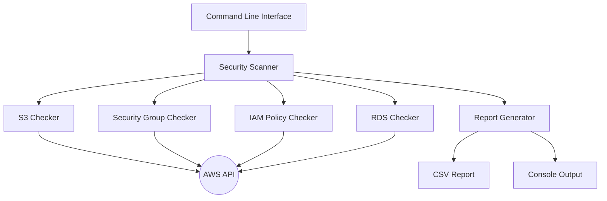
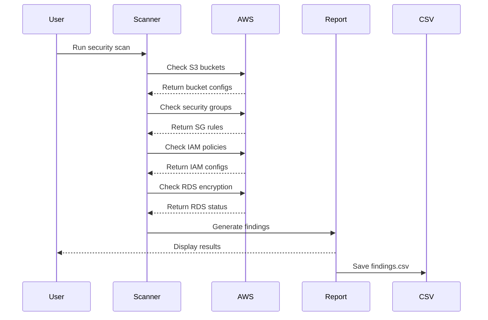
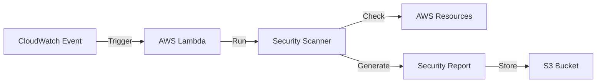

# AWS Security Scanner

A comprehensive security auditing tool for AWS resources that helps identify potential security risks and misconfigurations in your AWS infrastructure.

## Features

- **S3 Bucket Security Checks**
  - Identifies publicly accessible buckets
  - Detects misconfigured bucket policies
  - Can automatically fix public access issues

- **Security Group Analysis**
  - Finds security groups with dangerous inbound rules
  - Detects open SSH (22) and RDP (3389) ports
  - Identifies overly permissive rules (0.0.0.0/0)

- **IAM Security Audit**
  - Discovers overly permissive IAM policies
  - Identifies old access keys (>90 days)
  - Reports policies with dangerous wildcards

- **RDS Security Checks**
  - Finds unencrypted databases
  - Reports encryption status for all instances

## Project Architecture

### Component Diagram


### Workflow Diagram


### Lambda Deployment


## Usage

Basic usage:
```bash
python src/aws_security_scanner.py
```

Scan multiple regions:
```bash
python src/aws_security_scanner.py --regions us-east-1 us-west-2 eu-west-1
```

Enable automatic fixes:
```bash
python src/aws_security_scanner.py --fix
```

## Required IAM Permissions

The scanner requires the following IAM permissions:

```json
{
    "Version": "2012-10-17",
    "Statement": [
        {
            "Effect": "Allow",
            "Action": [
                "s3:ListAllMyBuckets",
                "s3:GetBucketAcl",
                "s3:GetBucketPolicy",
                "s3:PutBucketPublicAccessBlock",
                "ec2:DescribeSecurityGroups",
                "rds:DescribeDBInstances",
                "iam:ListPolicies",
                "iam:GetPolicyVersion",
                "iam:ListUsers",
                "iam:ListAccessKeys"
            ],
            "Resource": "*"
        }
    ]
}
```

## Deploying as AWS Lambda

1. Create a ZIP package:
```bash
zip -r scanner.zip src/ requirements.txt
```

2. Create a Lambda function using the following Terraform configuration:

```hcl
resource "aws_iam_role" "scanner_role" {
  name = "security_scanner_role"

  assume_role_policy = jsonencode({
    Version = "2012-10-17"
    Statement = [
      {
        Action = "sts:AssumeRole"
        Effect = "Allow"
        Principal = {
          Service = "lambda.amazonaws.com"
        }
      }
    ]
  })
}

resource "aws_iam_role_policy_attachment" "scanner_policy" {
  role       = aws_iam_role.scanner_role.name
  policy_arn = "arn:aws:iam::aws:policy/SecurityAudit"
}

resource "aws_lambda_function" "security_scanner" {
  filename         = "scanner.zip"
  function_name    = "aws_security_scanner"
  role            = aws_iam_role.scanner_role.arn
  handler         = "src.aws_security_scanner.lambda_handler"
  runtime         = "python3.10"
  timeout         = 300

  environment {
    variables = {
      REGIONS = "us-east-1,us-west-2"
    }
  }
}

resource "aws_cloudwatch_event_rule" "daily_scan" {
  name                = "daily_security_scan"
  description         = "Trigger security scanner daily"
  schedule_expression = "rate(1 day)"
}

resource "aws_cloudwatch_event_target" "scan" {
  rule      = aws_cloudwatch_event_rule.daily_scan.name
  target_id = "SecurityScan"
  arn       = aws_lambda_function.security_scanner.arn
}
```

## Running Tests

```bash
pytest tests/
```

## Contributing

1. Fork the repository
2. Create a feature branch
3. Commit your changes
4. Push to the branch
5. Create a Pull Request

## License

This project is licensed under the MIT License - see the LICENSE file for details. 